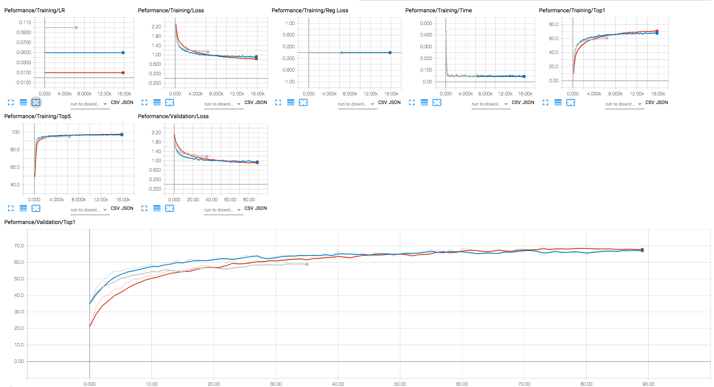
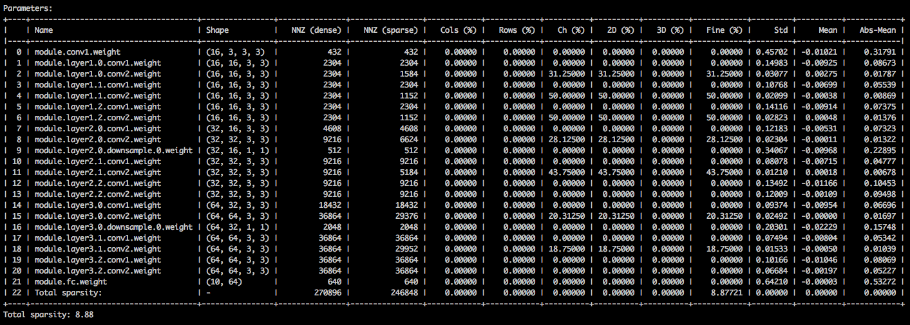
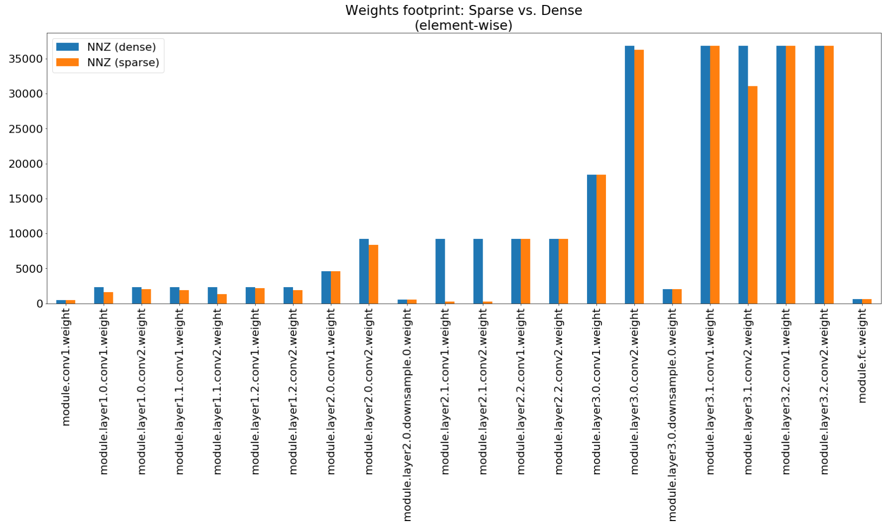
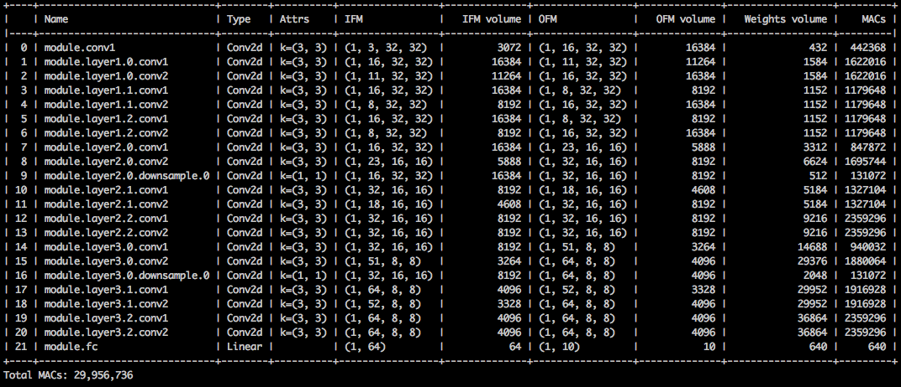
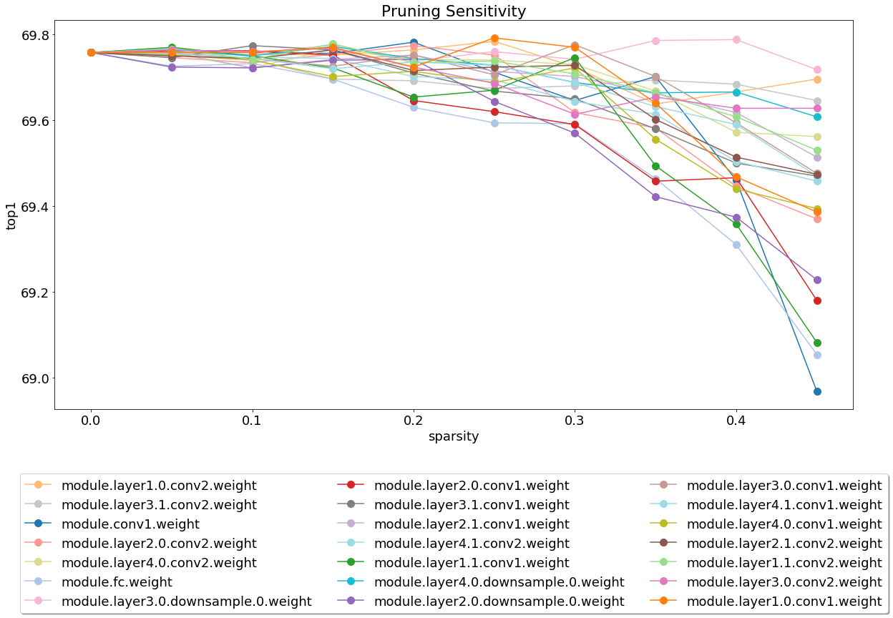

<center> </center>

[](https://github.com/IntelLabs/distiller/blob/master/LICENSE)
[](https://zenodo.org/badge/latestdoi/130871393)

<div align="center">
  <h3>
    <a href="https://github.com/IntelLabs/distiller/wiki">
      Wiki and tutorials
    </a>
    <span> | </span>
    <a href="https://intellabs.github.io/distiller/index.html">
      Documentation
    </a>
    <span> | </span>
    <a href="#getting-started">
      Getting Started
    </a>
    <span> | </span>
    <a href="https://intellabs.github.io/distiller/algo_pruning.html">
      Algorithms
    </a>
    <span> | </span>
    <a href="https://intellabs.github.io/distiller/design.html">
      Design
    </a>
    <span> | </span>
    <a href="https://github.com/IntelLabs/distiller/wiki/Frequently-Asked-Questions-(FAQ)">
      FAQ
    </a>
  </h3>
</div>

**Distiller** is an open-source Python package for neural network compression research.

Network compression can reduce the memory footprint of a neural network, increase its inference speed and save energy. Distiller provides a [PyTorch](http://pytorch.org/) environment for prototyping and analyzing compression algorithms, such as sparsity-inducing methods and low-precision arithmetic.


## Table of Contents

- [Table of Contents](#table-of-contents)
- [Highlighted features](#highlighted-features)
- [Installation](#installation)
- [Getting Started](#getting-started)
  - [Basic Usage Examples](#basic-usage-examples)
  - [Explore the sample Jupyter notebooks](#explore-the-sample-jupyter-notebooks)
- [Running the tests](#running-the-tests)
- [Generating the HTML documentation site](#generating-the-html-documentation-site)
- [Versioning](#versioning)
- [License](#license)
- [Community](#community)
- [Acknowledgments](#acknowledgments)
- [Disclaimer](#disclaimer)

## Highlighted features
* **Automatic Compression**
  - [Automated Model Compression](https://github.com/IntelLabs/distiller/blob/master/examples/auto_compression/amc) (AMC)
* **Weight pruning**
  - Element-wise pruning using magnitude thresholding, sensitivity thresholding, target sparsity level, and activation statistics 
* **Structured pruning**
  - Convolution: 2D (kernel-wise), 3D (filter-wise), 4D (layer-wise), and channel-wise structured pruning.  
  - Fully-connected: column-wise and row-wise structured pruning.
  - Structure groups (e.g. structures of 4 filters).
  - Structure-ranking with using weights or activations criteria (Lp-norm, APoZ, gradients, random, etc.).
  - Support for new structures (e.g. block pruning)
* **Control**
  - Soft (mask on forward-pass only) and hard pruning (permanently disconnect neurons)
  - Dual weight copies (compute loss on masked weights, but update unmasked weights)  
  - Model thinning (AKA "network garbage removal") to permanently remove pruned neurons and connections.
* **Schedule**
  - Flexible scheduling of pruning, regularization, and learning rate decay (compression scheduling)
  - One-shot and iterative pruning (and fine-tuning) are supported.
  - Easily control what is performed each training step (e.g. greedy layer by layer pruning to full model pruning). 
  - Automatic gradual schedule (AGP) for pruning individual connections and complete structures.
  - The compression schedule is expressed in a YAML file so that a single file captures the details of experiments.  This [dependency injection](https://en.wikipedia.org/wiki/Dependency_injection) design decouples the Distiller scheduler and library from future extensions of algorithms.
* Element-wise and filter-wise pruning **sensitivity analysis** (using L1-norm thresholding). Examine the data from some of the networks we analyzed, using [this notebook](https://github.com/IntelLabs/distiller/blob/master/jupyter/sensitivity_analysis.ipynb).
* **Regularization**
  - L1-norm element-wise regularization
  - Group Lasso an group variance regularization   
* **Quantization**
  - Automatic mechanism to transform existing models to quantized versions, with customizable bit-width configuration for different layers. No need to re-write the model for different quantization methods.
  - [Post-training quantization](https://intellabs.github.io/distiller/usage.html#post-training-quantization) of trained full-precision models, dynamic and static (statistics-based)
  - Support for [quantization-aware training](https://intellabs.github.io/distiller/algo_quantization.html#quantization-aware-training) in the loop
* **Knowledge distillation**
  - Training with [knowledge distillation](https://intellabs.github.io/distiller/knowledge_distillation.html), in conjunction with the other available pruning / regularization / quantization methods.
* **Conditional computation**
  - Sample implementation of Early Exit
* **Low rank decomposition**
  - Sample implementation of [truncated SVD](https://github.com/IntelLabs/distiller/blob/master/jupyter/truncated_svd.ipynb)
* Lottery Ticket Hypothesis training 
* Export statistics summaries using Pandas dataframes, which makes it easy to slice, query, display and graph the data.
* A set of [Jupyter notebooks](https://intellabs.github.io/distiller/jupyter.html) to plan experiments and analyze compression results.  The graphs and visualizations you see on this page originate from the included Jupyter notebooks.  
  + Take a look at [this notebook](https://github.com/IntelLabs/distiller/blob/master/jupyter/alexnet_insights.ipynb), which compares visual aspects of dense and sparse Alexnet models.
  + [This notebook](https://github.com/IntelLabs/distiller/blob/master/jupyter/model_summary.ipynb) creates performance indicator graphs from model data.
* Sample implementations of published research papers, using library-provided building blocks.  See the  research papers discussions in our [model-zoo](https://intellabs.github.io/distiller/model_zoo.html).
* Logging to the console, text file and TensorBoard-formatted file.
* Export to **ONNX** (export of quantized models pending ONNX standardization)

## Installation

These instructions will help get Distiller up and running on your local machine.

<details><summary><b>1. Clone Distiller</b></summary>	
<p>
  
Clone the Distiller code repository from github:
```
$ git clone https://github.com/IntelLabs/distiller.git
```
The rest of the documentation that follows, assumes that you have cloned your repository to a directory called ```distiller```. <br>
</p>
</details>
  
<details><summary><b>2. Create a Python virtual environment</b></summary>	
<p>

We recommend using a [Python virtual environment](https://docs.python.org/3/library/venv.html#venv-def), but that of course, is up to you.
There's nothing special about using Distiller in a virtual environment, but we provide some instructions, for completeness.<br>
Before creating the virtual environment, make sure you are located in directory ```distiller```.  After creating the environment, you should see a directory called ```distiller/env```.
<br>
#### Using virtualenv
If you don't have virtualenv installed, you can find the installation instructions [here](https://packaging.python.org/guides/installing-using-pip-and-virtualenv/).

To create the environment, execute:
```
$ python3 -m virtualenv env
```
This creates a subdirectory named ```env``` where the python virtual environment is stored, and configures the current shell to use it as the default python environment.

#### Using venv
If you prefer to use ```venv```, then begin by installing it:
```
$ sudo apt-get install python3-venv
```
Then create the environment:
```
$ python3 -m venv env
```
As with virtualenv, this creates a directory called ```distiller/env```.<br>

#### Activate the environment
The environment activation and deactivation commands for ```venv``` and ```virtualenv``` are the same.<br>
**!NOTE: Make sure to activate the environment, before proceeding with the installation of the dependency packages:<br>**
```
$ source env/bin/activate
```
</p>
</details>

<details><summary><b>3. Install the Distiller package</b></summary>	
<p>
  
Finally, install the Distiller package and its dependencies using ```pip3```:
```
$ cd distiller
$ pip3 install -e .
```
This installs Distiller in "development mode", meaning any changes made in the code are reflected in the environment without re-running the install command (so no need to re-install after pulling changes from the Git repository).

Notes:
- Distiller has only been tested on Ubuntu 16.04 LTS, and with Python 3.5.
- If you are not using a GPU, you might need to make small adjustments to the code.

</p>
</details>

### Required PyTorch Version

Distiller is tested using the default installation of PyTorch 1.3.1, which uses CUDA 10.1. We use TorchVision version 0.4.2. These are included in Distiller's `requirements.txt` and will be automatically installed when installing the Distiller package as listed above.

If you do not use CUDA 10.1 in your environment, please refer to [PyTorch website](https://pytorch.org/get-started/locally/) to install the compatible build of PyTorch 1.3.1 and torchvision 0.4.2.

## Getting Started

Distiller comes with sample applications and tutorials covering a range of model types:

| Model Type | Sparsity | Post-training quantization | Quantization-aware training | Auto Compression (AMC) | Knowledge Distillation |
|------------|:--------:|:--------------------------:|:---------------------------:|:----------------------:|:--------:|
| [Image classification](https://github.com/IntelLabs/distiller/tree/master/examples/classifier_compression) | :white_check_mark: | :white_check_mark: | :white_check_mark: | :white_check_mark: | :white_check_mark: |
| [Word-level language model](https://github.com/IntelLabs/distiller/tree/master/examples/word_language_model)| :white_check_mark: | :white_check_mark: | | |
| [Translation (GNMT)](https://github.com/IntelLabs/distiller/tree/master/examples/GNMT) | | :white_check_mark: | | |
| [Recommendation System (NCF)](https://github.com/IntelLabs/distiller/tree/master/examples/ncf) | |  :white_check_mark: | | |
| [Object Detection](https://github.com/IntelLabs/distiller/tree/master/examples/object_detection_compression) |  :white_check_mark: | | | |

Head to the [examples](https://github.com/IntelLabs/distiller/tree/master/examples) directory for more details.

Other resources to refer to, beyond the examples:
+ [Frequently-asked questions (FAQ)](https://github.com/IntelLabs/distiller/wiki/Frequently-Asked-Questions-(FAQ))
+ [Model zoo](https://intellabs.github.io/distiller/model_zoo.html)
+ [Compression scheduling](https://intellabs.github.io/distiller/schedule.html)
+ [Usage](https://intellabs.github.io/distiller/usage.html)
+ [Preparing a model for quantization](https://intellabs.github.io/distiller/prepare_model_quant.html)
+ [Tutorial: Pruning Filters & Channels](https://intellabs.github.io/distiller/tutorial-struct_pruning.html)

### Basic Usage Examples

The following are simple examples using Distiller's image classifcation sample, showing some of Distiller's capabilities.

+ [Training-only](#training-only)
+ [Getting parameter statistics of a sparsified model](#getting-parameter-statistics-of-a-sparsified-model)
+ [Post-training quantization](#post-training-quantization)

<details><summary><b>Example: Simple training-only session (no compression)</b></summary>	
<p>

The following will invoke training-only (no compression) of a network named 'simplenet' on the CIFAR10 dataset.  This is roughly based on TorchVision's sample Imagenet training application, so it should look familiar if you've used that application.  In  this example we don't invoke any compression mechanisms: we just train because for fine-tuning after pruning, training is an essential part.<br>  
Note that the first time you execute this command, the CIFAR10 code will be downloaded to your machine, which may take a bit of time - please let the download process proceed to completion.

The path to the CIFAR10 dataset is arbitrary, but in our examples we place the datasets in the same directory level as distiller (i.e. ```../../../data.cifar10```).

First, change to the sample directory, then invoke the application:
```
$ cd distiller/examples/classifier_compression
$ python3 compress_classifier.py --arch simplenet_cifar ../../../data.cifar10 -p 30 -j=1 --lr=0.01
```

You can use a TensorBoard backend to view the training progress (in the diagram below we show a couple of training sessions with different LR values).  For compression sessions, we've added tracing of activation and parameter sparsity levels, and regularization loss.
<center> </center>

</p>
</details>

<details><summary><b>Example: Getting parameter statistics of a sparsified model</b></summary>	
<p>

We've included in the git repository a few checkpoints of a ResNet20 model that we've trained with 32-bit floats.  Let's load the checkpoint of a model that we've trained with channel-wise Group Lasso regularization.<br>
With the following command-line arguments, the sample application loads the model (```--resume```)  and prints statistics about the model weights (```--summary=sparsity```).  This is useful if you want to load a previously pruned model, to examine the weights sparsity statistics, for example.  Note that when you *resume* a stored checkpoint, you still need to tell the application which network architecture the checkpoint uses (```-a=resnet20_cifar```):
```
$ python3 compress_classifier.py --resume=../ssl/checkpoints/checkpoint_trained_ch_regularized_dense.pth.tar -a=resnet20_cifar ../../../data.cifar10 --summary=sparsity
```
<center> </center>

You should see a text table detailing the various sparsities of the parameter tensors.  The first column is the parameter name, followed by its shape, the number of non-zero elements (NNZ) in the dense model, and in the sparse model.  The next set of columns show the column-wise, row-wise, channel-wise, kernel-wise, filter-wise and element-wise sparsities.
<br>
Wrapping it up are the standard-deviation, mean, and mean of absolute values of the elements.

In the [Compression Insights notebook](https://github.com/IntelLabs/distiller/blob/master/jupyter/compression_insights.ipynb) we use matplotlib to plot a bar chart of this summary, that indeed show non-impressive footprint compression.

<center> </center>


Although the memory footprint compression is very low, this model actually saves 26.6% of the MACs compute.  
```
$ python3 compress_classifier.py --resume=../ssl/checkpoints/checkpoint_trained_channel_regularized_resnet20_finetuned.pth.tar -a=resnet20_cifar ../../../data.cifar10 --summary=compute
```
<center> </center>
</p>
</details>

<details><summary><b>Example: Post-training quantization</b></summary>	
<p>

This example performs 8-bit quantization of ResNet20 for CIFAR10.  We've included in the git repository the checkpoint of a ResNet20 model that we've trained with 32-bit floats, so we'll take this model and quantize it:

```
$ python3 compress_classifier.py -a resnet20_cifar ../../../data.cifar10 --resume ../ssl/checkpoints/checkpoint_trained_dense.pth.tar --quantize-eval --evaluate
```

The command-line above will save a checkpoint named `quantized_checkpoint.pth.tar` containing the quantized model parameters. See more examples [here](https://github.com/IntelLabs/distiller/blob/master/examples/quantization/post_train_quant/command_line.md).
</p>
</details>

### Explore the sample Jupyter notebooks
The set of notebooks that come with Distiller is described [here](https://intellabs.github.io/distiller/jupyter.html#using-the-distiller-notebooks), which also explains the steps to install the Jupyter notebook server.<br>
After installing and running the server, take a look at the [notebook](https://github.com/IntelLabs/distiller/blob/master/jupyter/sensitivity_analysis.ipynb) covering pruning sensitivity analysis.

Sensitivity analysis is a long process and this notebook loads CSV files that are the output of several sessions of sensitivity analysis.
<center> </center>

## Running the tests
We are currently light-weight on test and this is an area where contributions will be much appreciated.<br>
There are two types of tests: system tests and unit-tests.  To invoke the unit tests:
```
$ cd distiller/tests
$ pytest
```

We use CIFAR10 for the system tests, because its size makes for quicker tests.  To invoke the system tests, you need to provide a path to the CIFAR10 dataset which you've already downloaded.  Alternatively, you may invoke ```full_flow_tests.py``` without specifying the location of the CIFAR10 dataset and let the test download the dataset (for the first invocation only).  Note that ```--cifar1o-path``` defaults to the current directory. <br>
The system tests are not short, and are even longer if the test needs to download the dataset.  

```
$ cd distiller/tests
$ python full_flow_tests.py --cifar10-path=<some_path>
```

The script exits with status 0 if all tests are successful, or status 1 otherwise.

## Generating the HTML documentation site
Install mkdocs and the required packages by executing:

```
$ pip3 install -r doc-requirements.txt
```

To build the project documentation run:
```
$ cd distiller/docs-src
$ mkdocs build --clean
```
This will create a folder named 'site' which contains the documentation website.
Open distiller/docs/site/index.html to view the documentation home page.

## Versioning

We use [SemVer](http://semver.org/) for versioning. For the versions available, see the [tags on this repository](https://github.com/IntelLabs/distiller/tags).

## License

This project is licensed under the Apache License 2.0 - see the [LICENSE.md](LICENSE.md) file for details

## Community
<details><summary><b>Github projects using Distiller</b></summary>	
<p>
  
- [DeGirum Pruned Models](https://github.com/DeGirum/pruned-models) - a repository containing pruned models and related information.

- [TorchFI](https://github.com/bfgoldstein/torchfi) - TorchFI is a fault injection framework build on top of PyTorch for research purposes.

- [hsi-toolbox](https://github.com/daniel-rychlewski/hsi-toolbox) - Hyperspectral CNN compression and band selection

</p>	
</details>

<details><summary><b>Research papers citing Distiller</b></summary>	
<p>
  
- Brunno F. Goldstein, Sudarshan Srinivasan, Dipankar Das, Kunal Banerjee, Leandro Santiago, Victor C. Ferreira, Alexandre S. Nery, Sandip Kundu, Felipe M. G. Franca.<br>
*[Reliability Evaluation of Compressed Deep Learning Models](https://ieeexplore.ieee.org/document/9069026)*,<br>
In IEEE 11th Latin American Symposium on Circuits & Systems (LASCAS), San Jose, Costa Rica, 2020, pp. 1-5.
  
- Pascal Bacchus, Robert Stewart, Ekaterina Komendantskaya.<br>
*[Accuracy, Training Time and Hardware Efficiency Trade-Offs for Quantized Neural Networks on FPGAs](https://link.springer.com/chapter/10.1007/978-3-030-44534-8_10)*,<br>
In Applied Reconfigurable Computing. Architectures, Tools, and Applications. ARC 2020. Lecture Notes in Computer Science, vol 12083. Springer, Cham

- Indranil Chakraborty, Mustafa Fayez Ali, Dong Eun Kim, Aayush Ankit, Kaushik Roy.<br>
*[GENIEx: A Generalized Approach to Emulating Non-Ideality in Memristive Xbars using Neural Networks](https://arxiv.org/abs/2003.06902)*,<br>
arXiv:2003.06902, 2020.

- Ahmed T. Elthakeb, Prannoy Pilligundla, Fatemehsadat Mireshghallah, Tarek Elgindi, Charles-Alban Deledalle, Hadi Esmaeilzadeh.<br>
*[Gradient-Based Deep Quantization of Neural Networks through Sinusoidal
Adaptive Regularization](https://arxiv.org/abs/2003.00146)*,<br>
arXiv:2003.00146, 2020.

- Ziqing Yang, Yiming Cui, Zhipeng Chen, Wanxiang Che, Ting Liu, Shijin Wang, Guoping Hu.<br>
*[TextBrewer: An Open-Source Knowledge Distillation Toolkit for Natural Language Processing](https://arxiv.org/abs/2002.12620)*,<br>
arXiv:2002.12620, 2020.

- Alexander Kozlov, Ivan Lazarevich, Vasily Shamporov, Nikolay Lyalyushkin, Yury Gorbachev.<br>
*[Neural Network Compression Framework for fast model inference](https://arxiv.org/abs/2002.08679)*,<br>
arXiv:2002.08679, 2020.

- Moran Shkolnik, Brian Chmiel, Ron Banner, Gil Shomron, Yuri Nahshan, Alex Bronstein, Uri Weiser.<br>
*[Robust Quantization: One Model to Rule Them All](https://arxiv.org/abs/2002.07686)*,<br>
arXiv:2002.07686, 2020.

- Muhammad Abdullah Hanif, Muhammad Shafique.<br>
*[SalvageDNN: salvaging deep neural network accelerators with permanent faults through saliency-driven fault-aware mapping](https://royalsocietypublishing.org/doi/10.1098/rsta.2019.0164)*,<br>
In Philosophical Transactions of the Royal Society A: Mathematical, Physical and Engineering SciencesVolume 378, Issue 2164, 2019.<br>
https://doi.org/10.1098/rsta.2019.0164

- Meiqi Wang, Jianqiao Mo, Jun Lin, Zhongfeng Wang, Li Du.<br>
*[DynExit: A Dynamic Early-Exit Strategy for Deep Residual Networks](https://ieeexplore.ieee.org/stamp/stamp.jsp?arnumber=9020551)*,<br>
In IEEE International Workshop on Signal Processing Systems (SiPS), 2019.

- Vinu Joseph, Saurav Muralidharan, Animesh Garg, Michael Garland, Ganesh Gopalakrishnan.<br>
*[A Programmable Approach to Model Compression](https://arxiv.org/abs/1911.02497),*<br>
arXiv:1911.02497, 2019<br>
[code](https://github.com/NVlabs/condensa)

- Hui Guan, Lin Ning, Zhen Lin, Xipeng Shen, Huiyang Zhou, Seung-Hwan Lim.<br>
*[In-Place Zero-Space Memory Protection for CNN](https://arxiv.org/abs/1910.14479)*,<br>
In Conference on Neural Information Processing Systems (NeurIPS), 2019.<br>
arXiv:1910.14479, 2019<br>
[code](https://github.com/guanh01/wot)

- Hossein Baktash, Emanuele Natale, Laurent Viennot.<br>
*[A Comparative Study of Neural Network Compression](https://arxiv.org/abs/1910.11144)*,<br>
arXiv:1910.11144, 2019.

- Maxim Zemlyanikin, Alexander Smorkalov, Tatiana Khanova, Anna Petrovicheva, Grigory Serebryakov.<br>
*[512KiB RAM Is Enough! Live Camera Face Recognition DNN on MCU](http://openaccess.thecvf.com/content_ICCVW_2019/html/LPCV/Zemlyanikin_512KiB_RAM_Is_Enough_Live_Camera_Face_Recognition_DNN_on_ICCVW_2019_paper.html)*,<br>
In IEEE International Conference on Computer Vision (ICCV), 2019.

- Ziheng Wang, Jeremy Wohlwend, Tao Lei.<br>
*[Structured Pruning of Large Language Models](https://arxiv.org/abs/1910.04732)*,<br>
arXiv:1910.04732, 2019.

- Soroush Ghodrati, Hardik Sharma, Sean Kinzer, Amir Yazdanbakhsh, Kambiz Samadi, Nam Sung Kim, Doug Burger, Hadi Esmaeilzadeh.<br>
*[Mixed-Signal Charge-Domain Acceleration of Deep Neural networks through Interleaved Bit-Partitioned Arithmetic](https://arxiv.org/abs/1906.11915)*,<br>
arXiv:1906.11915, 2019.

- Gil Shomron, Tal Horowitz, Uri Weiser.<br>
*[SMT-SA: Simultaneous Multithreading in Systolic Arrays](https://ieeexplore.ieee.org/document/8742541)*,<br>
In IEEE Computer Architecture Letters (CAL), 2019.

- Shangqian Gao , Cheng Deng , and Heng Huang.<br>
 *[Cross Domain Model Compression by Structurally Weight Sharing](http://openaccess.thecvf.com/content_CVPR_2019/html/Gao_Cross_Domain_Model_Compression_by_Structurally_Weight_Sharing_CVPR_2019_paper.html),*<br>
 In The IEEE Conference on Computer Vision and Pattern Recognition (CVPR), 2019, pp. 8973-8982.
 
- Moin Nadeem, Wei Fang, Brian Xu, Mitra Mohtarami, James Glass.<br>
  *[FAKTA: An Automatic End-to-End Fact Checking System](https://arxiv.org/abs/1906.04164),*<br>
  In North American Chapter of the Association for Computational Linguistics (NAACL), 2019.

- Ahmed T. Elthakeb, Prannoy Pilligundla, Hadi Esmaeilzadeh.<br>
  *[SinReQ: Generalized Sinusoidal Regularization for Low-Bitwidth Deep Quantized Training](https://arxiv.org/abs/1905.01416),*<br>
  arXiv:1905.01416, 2019.
  [code](https://github.com/sinreq/sinreq_code)
  
- Goncharenko A., Denisov A., Alyamkin S., Terentev E.<br>
*[Trainable Thresholds for Neural Network Quantization](https://rd.springer.com/chapter/10.1007/978-3-030-20518-8_26),*<br>
In: Rojas I., Joya G., Catala A. (eds) Advances in Computational Intelligence Lecture Notes in Computer Science, vol 11507. Springer, Cham.  International Work-Conference on Artificial Neural Networks (IWANN 2019).

- Ahmed T. Elthakeb, Prannoy Pilligundla, Hadi Esmaeilzadeh.<br>
*[Divide and Conquer: Leveraging Intermediate Feature Representations for Quantized Training of Neural Networks](https://arxiv.org/abs/1906.06033),*<br>
arXiv:1906.06033, 2019

- Ritchie Zhao, Yuwei Hu, Jordan Dotzel, Christopher De Sa, Zhiru Zhang.<br>
  *[Improving Neural Network Quantization without Retraining using Outlier Channel Splitting](https://arxiv.org/abs/1901.09504),*<br>
  arXiv:1901.09504, 2019<br>
  [Code](https://github.com/cornell-zhang/dnn-quant-ocs)

- Angad S. Rekhi, Brian Zimmer, Nikola Nedovic, Ningxi Liu, Rangharajan Venkatesan, Miaorong Wang, Brucek Khailany, William J. Dally, C. Thomas Gray.<br>
*[Analog/Mixed-Signal Hardware Error Modeling for Deep Learning Inference](https://research.nvidia.com/sites/default/files/pubs/2019-06_Analog/Mixed-Signal-Hardware-Error/40_2_Rekhi_AMS_ML.pdf)*,<br>
Nvidia Research, 2019.

- Norio Nakata.<br>
*[Recent Technical Development of Artificial Intelligence for Diagnostic Medical Imaging]( https://rd.springer.com/article/10.1007/s11604-018-0804-6)*,<br>
In Japanese Journal of Radiology, February 2019, Volume 37, Issue 2, pp 103–108.

-  Alexander Goncharenko, Andrey Denisov, Sergey Alyamkin, Evgeny Terentev.<br>
   *[Fast Adjustable Threshold For Uniform Neural Network Quantization](https://arxiv.org/abs/1812.07872)*,<br>
   arXiv:1812.07872, 2018
</p>	
</details>

If you used Distiller for your work, please use the following citation:

```
@article{nzmora2019distiller,
  author       = {Neta Zmora and
                  Guy Jacob and
                  Lev Zlotnik and
                  Bar Elharar and
                  Gal Novik},
  title        = {Neural Network Distiller: A Python Package For DNN Compression Research},
  month        = {October},
  year         = {2019},
  url          = {https://arxiv.org/abs/1910.12232}
}
```


## Acknowledgments

Any published work is built on top of the work of many other people, and the credit belongs to too many people to list here.
* The Python and PyTorch developer communities have shared many invaluable insights, examples and ideas on the Web.
* The authors of the research papers implemented in the [Distiller model-zoo](https://intellabs.github.io/distiller/model_zoo.html) have shared their research ideas, theoretical background and results.

### Built With

* [PyTorch](http://pytorch.org/) - The tensor and neural network framework used by Distiller.
* [Jupyter](http://jupyter.org/) - Notebook serving.
* [TensorBoard](https://www.tensorflow.org/programmers_guide/summaries_and_tensorboard) - Used to view training graphs.
* [Cadene](https://github.com/Cadene/pretrained-models.pytorch) - Pretrained PyTorch models.

## Disclaimer
Distiller is released as a reference code for research purposes. It is not an official Intel product, and the level of quality and support may not be as expected from an official product. Additional algorithms and features are planned to be added to the library. Feedback and contributions from the open source and research communities are more than welcome.

## usage
```
python compression_classifier.py -h

usage: compress_classifier.py [-h] [--arch ARCH] [-j N] [--epochs N] [-b N]
                              [--lr LR] [--momentum M] [--weight-decay W]
                              [--print-freq N] [--verbose]
                              [--resume-from PATH | --exp-load-weights-from PATH]
                              [--pretrained] [--reset-optimizer] [-e]
                              [--activation-stats PHASE [PHASE ...]]
                              [--activation-histograms PORTION_OF_TEST_SET]
                              [--masks-sparsity] [--param-hist]
                              [--summary {sparsity,compute,model,modules,png,png_w_params}]
                              [--export-onnx [EXPORT_ONNX]]
                              [--compress [COMPRESS]]
                              [--sense {element,filter,channel}]
                              [--sense-range SENSITIVITY_RANGE SENSITIVITY_RANGE SENSITIVITY_RANGE]
                              [--deterministic] [--seed SEED] [--gpus DEV_ID]
                              [--cpu] [--name NAME] [--out-dir OUTPUT_DIR]
                              [--validation-split VALIDATION_SPLIT]
                              [--effective-train-size EFFECTIVE_TRAIN_SIZE]
                              [--effective-valid-size EFFECTIVE_VALID_SIZE]
                              [--effective-test-size EFFECTIVE_TEST_SIZE]
                              [--confusion]
                              [--num-best-scores NUM_BEST_SCORES]
                              [--load-serialized] [--thinnify]
                              [--quantize-eval] [--qe-mode QE_MODE]
                              [--qe-mode-acts QE_MODE_ACTS]
                              [--qe-mode-wts QE_MODE_WTS]
                              [--qe-bits-acts NUM_BITS]
                              [--qe-bits-wts NUM_BITS]
                              [--qe-bits-accum NUM_BITS]
                              [--qe-clip-acts QE_CLIP_ACTS]
                              [--qe-clip-n-stds QE_CLIP_N_STDS]
                              [--qe-no-clip-layers LAYER_NAME [LAYER_NAME ...]]
                              [--qe-no-quant-layers LAYER_NAME [LAYER_NAME ...]]
                              [--qe-per-channel]
                              [--qe-scale-approx-bits NUM_BITS]
                              [--qe-save-fp-weights] [--qe-convert-pytorch]
                              [--qe-pytorch-backend {fbgemm,qnnpack}]
                              [--qe-stats-file PATH | --qe-dynamic | --qe-calibration PORTION_OF_TEST_SET | --qe-config-file PATH]
                              [--qe-lapq] [--lapq-maxiter LAPQ_MAXITER]
                              [--lapq-maxfev LAPQ_MAXFEV]
                              [--lapq-method LAPQ_METHOD]
                              [--lapq-basinhopping]
                              [--lapq-basinhopping-niter LAPQ_BASINHOPPING_NITER]
                              [--lapq-init-mode LAPQ_INIT_MODE]
                              [--lapq-init-method LAPQ_INIT_METHOD]
                              [--lapq-eval-size LAPQ_EVAL_SIZE]
                              [--lapq-eval-memoize-dataloader]
                              [--lapq-search-clipping]
                              [--save-untrained-model]
                              [--earlyexit_lossweights [EARLYEXIT_LOSSWEIGHTS [EARLYEXIT_LOSSWEIGHTS ...]]]
                              [--earlyexit_thresholds [EARLYEXIT_THRESHOLDS [EARLYEXIT_THRESHOLDS ...]]]
                              [--kd-teacher ARCH] [--kd-pretrained]
                              [--kd-resume PATH] [--kd-temperature TEMP]
                              [--kd-distill-wt WEIGHT]
                              [--kd-student-wt WEIGHT]
                              [--kd-teacher-wt WEIGHT]
                              [--kd-start-epoch EPOCH_NUM] [--greedy]
                              [--greedy-ft-epochs GREEDY_FT_EPOCHS]
                              [--greedy-target-density GREEDY_TARGET_DENSITY]
                              [--greedy-pruning-step GREEDY_PRUNING_STEP]
                              [--greedy-finetuning-policy {constant,linear-grow}]
                              DATASET_DIR

Distiller image classification model compression

positional arguments:
  DATASET_DIR           path to dataset

optional arguments:
  -h, --help            show this help message and exit
  --arch ARCH, -a ARCH  model architecture: alexnet | alexnet_bn | bninception
                        | cafferesnet101 | densenet121 | densenet161 |
                        densenet169 | densenet201 | dpn107 | dpn131 | dpn68 |
                        dpn68b | dpn92 | dpn98 | fbresnet152 | googlenet |
                        inception_v3 | inceptionresnetv2 | inceptionv3 |
                        inceptionv4 | mnasnet0_5 | mnasnet0_75 | mnasnet1_0 |
                        mnasnet1_3 | mobilenet | mobilenet_025 | mobilenet_050
                        | mobilenet_075 | mobilenet_v1_dropout | mobilenet_v2
                        | nasnetalarge | nasnetamobile | plain20_cifar |
                        plain20_cifar_nobn | pnasnet5large | polynet |
                        preact_resnet101 | preact_resnet110_cifar |
                        preact_resnet110_cifar_conv_ds | preact_resnet152 |
                        preact_resnet18 | preact_resnet20_cifar |
                        preact_resnet20_cifar_conv_ds | preact_resnet32_cifar
                        | preact_resnet32_cifar_conv_ds | preact_resnet34 |
                        preact_resnet44_cifar | preact_resnet44_cifar_conv_ds
                        | preact_resnet50 | preact_resnet56_cifar |
                        preact_resnet56_cifar_conv_ds | resnet101 |
                        resnet110_cifar_earlyexit | resnet1202_cifar_earlyexit
                        | resnet152 | resnet18 | resnet20_cifar |
                        resnet20_cifar_earlyexit | resnet32_cifar |
                        resnet32_cifar_earlyexit | resnet34 | resnet44_cifar |
                        resnet44_cifar_earlyexit | resnet50 |
                        resnet50_earlyexit | resnet56_cifar |
                        resnet56_cifar_earlyexit | resnext101_32x4d |
                        resnext101_32x8d | resnext101_64x4d | resnext50_32x4d
                        | se_resnet101 | se_resnet152 | se_resnet50 |
                        se_resnext101_32x4d | se_resnext50_32x4d | senet154 |
                        shufflenet_v2_x0_5 | shufflenet_v2_x1_0 |
                        shufflenet_v2_x1_5 | shufflenet_v2_x2_0 |
                        simplenet2_cifar | simplenet_cifar | simplenet_mnist |
                        simplenet_v2_mnist | squeezenet1_0 | squeezenet1_1 |
                        vgg11 | vgg11_bn | vgg11_bn_cifar | vgg11_cifar |
                        vgg13 | vgg13_bn | vgg13_bn_cifar | vgg13_cifar |
                        vgg16 | vgg16_bn | vgg16_bn_cifar | vgg16_cifar |
                        vgg19 | vgg19_bn | vgg19_bn_cifar | vgg19_cifar |
                        wide_resnet101_2 | wide_resnet50_2 | xception
                        (default: resnet18)
  -j N, --workers N     number of data loading workers (default: 4)
  --epochs N            number of total epochs to run (default: 90
  -b N, --batch-size N  mini-batch size (default: 256)
  --print-freq N, -p N  print frequency (default: 10)
  --verbose, -v         Emit debug log messages
  -e, --evaluate        evaluate model on test set
  --activation-stats PHASE [PHASE ...], --act-stats PHASE [PHASE ...]
                        collect activation statistics on phases: train, valid,
                        and/or test (WARNING: this slows down training)
  --activation-histograms PORTION_OF_TEST_SET, --act-hist PORTION_OF_TEST_SET
                        Run the model in evaluation mode on the specified
                        portion of the test dataset and generate activation
                        histograms. NOTE: This slows down evaluation
                        significantly
  --masks-sparsity      print masks sparsity table at end of each epoch
  --param-hist          log the parameter tensors histograms to file (WARNING:
                        this can use significant disk space)
  --summary {sparsity,compute,model,modules,png,png_w_params}
                        sparsityprint a summary of the model, and exit -
                        options: | computeprint a summary of the model, and
                        exit - options: | modelprint a summary of the model,
                        and exit - options: | modulesprint a summary of the
                        model, and exit - options: | pngprint a summary of the
                        model, and exit - options: | png_w_params
  --export-onnx [EXPORT_ONNX]
                        export model to ONNX format
  --compress [COMPRESS]
                        configuration file for pruning the model (default is
                        to use hard-coded schedule)
  --sense {element,filter,channel}
                        test the sensitivity of layers to pruning
  --sense-range SENSITIVITY_RANGE SENSITIVITY_RANGE SENSITIVITY_RANGE
                        an optional parameter for sensitivity testing
                        providing the range of sparsities to test. This is
                        equivalent to creating sensitivities =
                        np.arange(start, stop, step)
  --deterministic, --det
                        Ensure deterministic execution for re-producible
                        results.
  --seed SEED           seed the PRNG for CPU, CUDA, numpy, and Python
  --gpus DEV_ID         Comma-separated list of GPU device IDs to be used
                        (default is to use all available devices)
  --cpu                 Use CPU only. Flag not set => uses GPUs according to
                        the --gpus flag value.Flag set => overrides the --gpus
                        flag
  --name NAME, -n NAME  Experiment name
  --out-dir OUTPUT_DIR, -o OUTPUT_DIR
                        Path to dump logs and checkpoints
  --validation-split VALIDATION_SPLIT, --valid-size VALIDATION_SPLIT, --vs VALIDATION_SPLIT
                        Portion of training dataset to set aside for
                        validation
  --effective-train-size EFFECTIVE_TRAIN_SIZE, --etrs EFFECTIVE_TRAIN_SIZE
                        Portion of training dataset to be used in each epoch.
                        NOTE: If --validation-split is set, then the value of
                        this argument is applied AFTER the train-validation
                        split according to that argument
  --effective-valid-size EFFECTIVE_VALID_SIZE, --evs EFFECTIVE_VALID_SIZE
                        Portion of validation dataset to be used in each
                        epoch. NOTE: If --validation-split is set, then the
                        value of this argument is applied AFTER the train-
                        validation split according to that argument
  --effective-test-size EFFECTIVE_TEST_SIZE, --etes EFFECTIVE_TEST_SIZE
                        Portion of test dataset to be used in each epoch
  --confusion           Display the confusion matrix
  --num-best-scores NUM_BEST_SCORES
                        number of best scores to track and report (default: 1)
  --load-serialized     Load a model without DataParallel wrapping it
  --thinnify            physically remove zero-filters and create a smaller
                        model
  --save-untrained-model
                        Save the randomly-initialized model before training
                        (useful for lottery-ticket method)
  --earlyexit_lossweights [EARLYEXIT_LOSSWEIGHTS [EARLYEXIT_LOSSWEIGHTS ...]]
                        List of loss weights for early exits (e.g.
                        --earlyexit_lossweights 0.1 0.3)
  --earlyexit_thresholds [EARLYEXIT_THRESHOLDS [EARLYEXIT_THRESHOLDS ...]]
                        List of EarlyExit thresholds (e.g.
                        --earlyexit_thresholds 1.2 0.9)
  --greedy              greedy filter pruning

Optimizer arguments:
  --lr LR, --learning-rate LR
                        initial learning rate
  --momentum M          momentum
  --weight-decay W, --wd W
                        weight decay (default: 1e-4)

Resuming arguments:
  --resume-from PATH    path to latest checkpoint. Use to resume paused
                        training session.
  --exp-load-weights-from PATH
                        path to checkpoint to load weights from (excluding
                        other fields) (experimental)
  --pretrained          use pre-trained model
  --reset-optimizer     Flag to override optimizer if resumed from checkpoint.
                        This will reset epochs count.

Post-Training Quantization Arguments:
  --quantize-eval, --qe
                        Apply linear quantization to model before evaluation.
                        Applicable only if --evaluate is also set
  --qe-mode QE_MODE, --qem QE_MODE
                        Default linear quantization mode (for weights and
                        activations). Choices: sym | sym_restr | asym_s |
                        asym_u
  --qe-mode-acts QE_MODE_ACTS, --qema QE_MODE_ACTS
                        Linear quantization mode for activations. Overrides
                        --qe-mode`. Choices: sym | sym_restr | asym_s | asym_u
  --qe-mode-wts QE_MODE_WTS, --qemw QE_MODE_WTS
                        Linear quantization mode for Weights. Overrides --qe-
                        mode`. Choices: sym | sym_restr | asym_s | asym_u
  --qe-bits-acts NUM_BITS, --qeba NUM_BITS
                        Number of bits for quantization of activations. Use 0
                        to not quantize activations. Default value is 8
  --qe-bits-wts NUM_BITS, --qebw NUM_BITS
                        Number of bits for quantization of weights. Use 0 to
                        not quantize weights. Default value is 8
  --qe-bits-accum NUM_BITS
                        Number of bits for quantization of the accumulator
  --qe-clip-acts QE_CLIP_ACTS, --qeca QE_CLIP_ACTS
                        Activations clipping mode. Choices: none | avg | n_std
                        | gauss | laplace
  --qe-clip-n-stds QE_CLIP_N_STDS
                        When qe-clip-acts is set to 'n_std', this is the
                        number of standard deviations to use
  --qe-no-clip-layers LAYER_NAME [LAYER_NAME ...], --qencl LAYER_NAME [LAYER_NAME ...]
                        List of layer names for which not to clip activations.
                        Applicable only if --qe-clip-acts is not 'none'
  --qe-no-quant-layers LAYER_NAME [LAYER_NAME ...], --qenql LAYER_NAME [LAYER_NAME ...]
                        List of layer names for which to skip quantization.
  --qe-per-channel, --qepc
                        Enable per-channel quantization of weights (per output
                        channel)
  --qe-scale-approx-bits NUM_BITS, --qesab NUM_BITS
                        Enables scale factor approximation using integer
                        multiply + bit shift, using this number of bits the
                        integer multiplier
  --qe-save-fp-weights  Allow weights requantization.
  --qe-convert-pytorch, --qept
                        Convert the model to PyTorch native post-train
                        quantization modules
  --qe-pytorch-backend {fbgemm,qnnpack}
                        When --qe-convert-pytorch is set, specifies the
                        PyTorch quantization backend to use
  --qe-stats-file PATH  Path to YAML file with pre-made calibration stats
  --qe-dynamic          Apply dynamic quantization
  --qe-calibration PORTION_OF_TEST_SET
                        Run the model in evaluation mode on the specified
                        portion of the test dataset and collect statistics
  --qe-config-file PATH
                        Path to YAML file containing configuration for
                        PostTrainRLinearQuantizer (if present, all other --qe*
                        arguments are ignored)
  --qe-lapq, --qe-coordinate-search
                        Optimize post-training quantization parameters using
                        LAPQ method

Post-Training Quantization Auto-Optimization (LAPQ) Arguments:
  --lapq-maxiter LAPQ_MAXITER
                        Max iteration for minimization method.
  --lapq-maxfev LAPQ_MAXFEV
                        Max iteration for minimization method.
  --lapq-method LAPQ_METHOD
                        Minimization method used by scip.optimize.minimize.
  --lapq-basinhopping, --lapq-bh
                        Use scipy.optimize.basinhopping stochastic global
                        minimum search.
  --lapq-basinhopping-niter LAPQ_BASINHOPPING_NITER, --lapq-bh-niter LAPQ_BASINHOPPING_NITER
                        Number of iterations for the basinhopping algorithm.
  --lapq-init-mode LAPQ_INIT_MODE
                        The mode of quant initalization. Choices:
                        NONE|AVG|LAPLACE|GAUSS|L1|L2|L3
  --lapq-init-method LAPQ_INIT_METHOD
                        If --lapq-init-mode was specified as L1/L2/L3, this
                        specifies the method of minimization.
  --lapq-eval-size LAPQ_EVAL_SIZE
                        Portion of test dataset to use for evaluation
                        function.
  --lapq-eval-memoize-dataloader
                        Stores the input batch in memory to optimize
                        performance.
  --lapq-search-clipping
                        Search on clipping values instead of scale/zero_point.

Knowledge Distillation Training Arguments:
  --kd-teacher ARCH     Model architecture for teacher model
  --kd-pretrained       Use pre-trained model for teacher
  --kd-resume PATH      Path to checkpoint from which to load teacher weights
  --kd-temperature TEMP, --kd-temp TEMP
                        Knowledge distillation softmax temperature
  --kd-distill-wt WEIGHT, --kd-dw WEIGHT
                        Weight for distillation loss (student vs. teacher soft
                        targets)
  --kd-student-wt WEIGHT, --kd-sw WEIGHT
                        Weight for student vs. labels loss
  --kd-teacher-wt WEIGHT, --kd-tw WEIGHT
                        Weight for teacher vs. labels loss
  --kd-start-epoch EPOCH_NUM
                        Epoch from which to enable distillation

Greedy Pruning:
  --greedy-ft-epochs GREEDY_FT_EPOCHS
                        number of epochs to fine-tune each discovered network
  --greedy-target-density GREEDY_TARGET_DENSITY
                        target density of the network we are seeking
  --greedy-pruning-step GREEDY_PRUNING_STEP
                        size of each pruning step (as a fraction in [0..1])
  --greedy-finetuning-policy {constant,linear-grow}
                        policy used for determining how long to fine-tune
```

